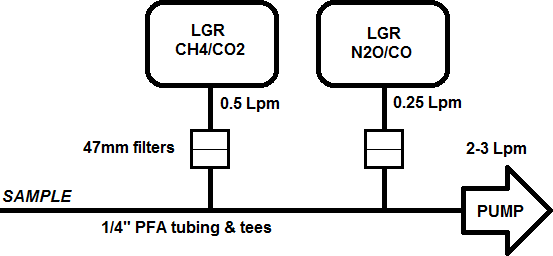
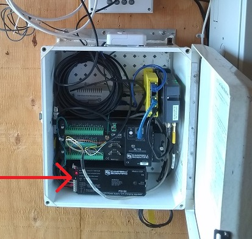
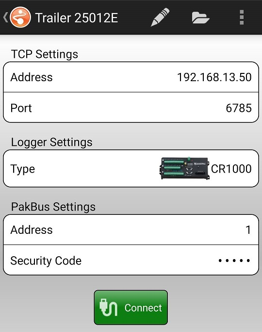
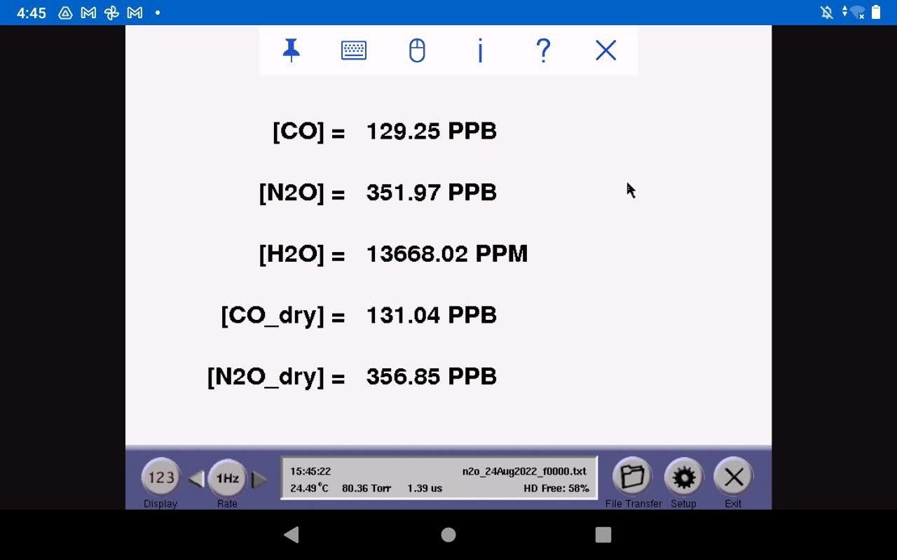
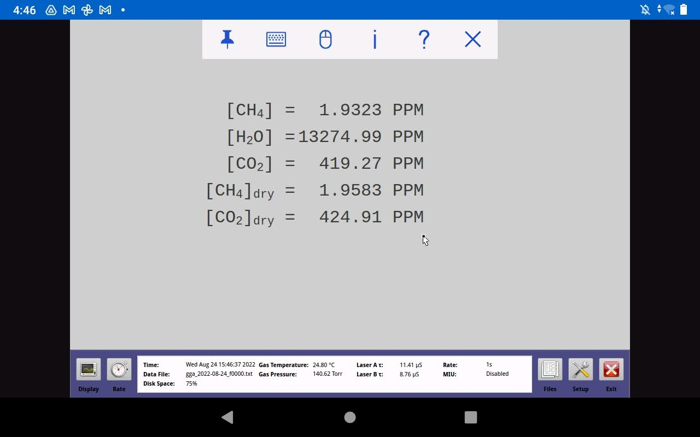
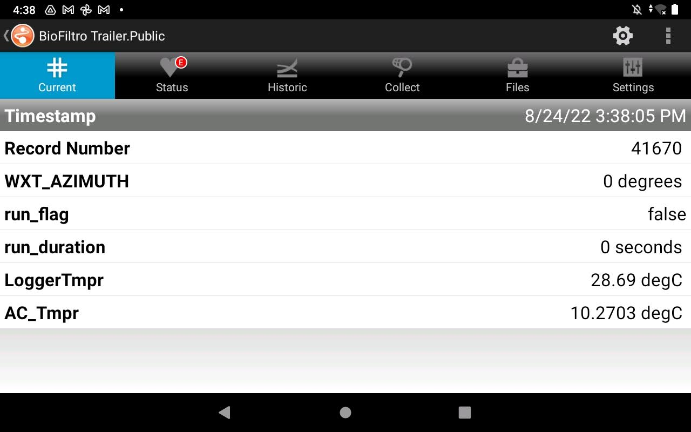
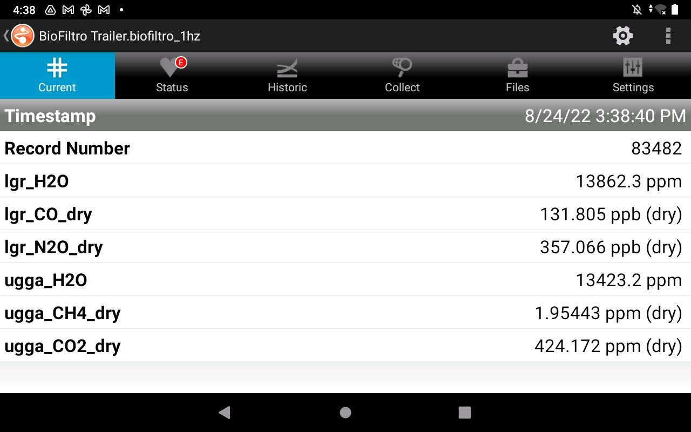
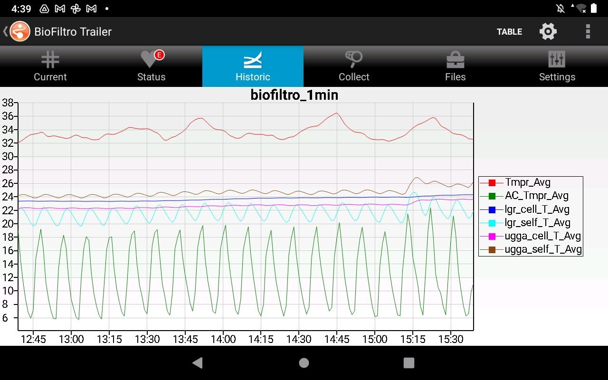
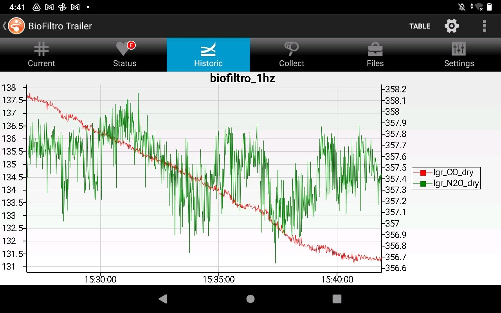
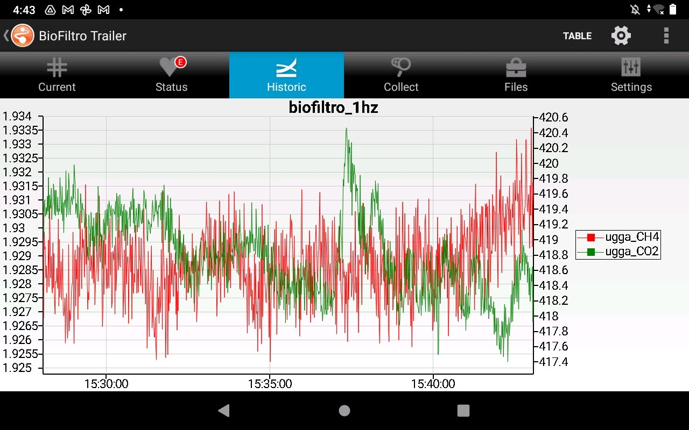

# BioFiltro Flux Measurements Logger

Program for obtaining meteorological and greenhouse gas (GHG) data from the
sensors listed in the table below using a [CR1000][1] datalogger. Data can be
monitored in real-time using the [LoggerLink][2] app on a phone or tablet while
connected to the trailer's wireless local area network. A user-controlled
processing flag allows for automatic data reduction of measurements made during
a sampling run. Raw measurements are also stored in separate data tables to
permit in-depth analysis. 

Specific instruments include:

* N2O/CO trace gas analyzer ([DLT-100 series; Los Gatos Research][5])
	* Nitrous oxide
	* Carbon monoxide
	* Water vapor
* CH4/CO2 trace gas analyzer ([UGGA; Los Gatos Research][6])
	* Methane
	* Carbon dioxide
	* Water vapor
* Total weather station ([WXT510; Vaisala][3])
	* Horizontal wind speed & direction 
	* Ambient temperature & relative humidity
	* Barometric pressure
	* Precipitation accumulation (rain & hail)
* Photosynthetically active radiation (PAR) sensor ([LI-190SA; LI-COR Biosciences][4])
* GPS receiver (for clock sync) ([GPS16X-HVS; Garmin][8])

## Setup

### Power

Connect trailer power cords to appropriate power sources:

| Cord type | Circuit | Min. breaker size |
|:--|:--|:--:|
| Orange, parallel blade plug | #1, for analyzers | 15A |
| Black, T-blade plug | #2, for air conditioner | 20A |

### Air conditioner

Turn on the A/C to **Cool** mode and set temperature to room temp (**72°C** or cooler). 

### Gas analyzers

Refer to manufacturer user guides for complete setup details. Be sure to:

1. Turn on the uninterruptible power supply (hold the power button for 3-5 seconds) before turning on the two trace gas analyzers. 
2. Verify connections for sampling plumbing before plugging in the flushing pump (see diagram below).
3. Verify serial data cables are connected to analyzers.
4. Verify analyzers are configured as described in **Configuration** section.

### Weather station & PAR sensor

The weather station and PAR sensor are mounted on the side of the trailer. Once
the trailer is positioned, remove protective covers items and verify sensors are
correctly deployed so that:

* the weather station is approximately level,
* the weather station is pointing northward (to avoid shading the PAR sensor), *and*
* the PAR sensor is also level 

If the weather station is not oriented exactly to geographic (True) north, the actual
azimuth should be updated in the logger program. See the **Operations** section.

A short step ladder may be required to level the PAR sensor. Refer to the sensor
user manual for mounting plate leveling instructions.

### Datalogger

Turn on the battery-backed power supply in the datalogger enclosure to enable
the logger (also the weather station and datacom equipment).

Review and update the following program constants before the start of sampling.
They can be modified using the handheld keyboard display, or by updating the
public Constants table named "`Constants`" and triggering a restart. 

* `UTC_OFFSET` - time offset relative to UTC, in hours (default: `-8` = Pacific Standard Time)
* `PAR_MULT` - unique sensor-specific calibration value, in &micro;mol/(mV s m2) (default: `-197.63`)

The following program variable must also be updated when the weather station is
installed and anytime it's adjusted. The variable can be updated by changing
itsvalue in the data table named "`Public`". Changes go into effect immediately
without any program restarts.

* `WXT_AZIMUTH` - orientation of the weather station w.r.t. True North, in degrees (default: `0` = True North)

## Operations

### LoggerLink

The no-cost mobile app [LoggerLink][2] is the recommended datalogger interface.
Connect to the trailer's wireless network and use the search feature, or use
the following setup details to create a new connection manually:

* Address: `192.168.13.50`
* Port: `6785` (default)
* Type: `CR1000`
* Pakbus Address: `1` (default)
* Security code: *update to match logger configuration*

> *Note if the security code does not match the logger, data may still be
viewable but public variables will not be editable and therefore triggering
sample runs will not be allowed.*

Alternatively, a handheld keyboard display (CR1000KD; Campbell Scientific) can
be used instead. The main disadvantages of the keyboard display are (1) lack
of interactive data plotting, and (2) being physically constrained by the
display's cable length.

### RealVNC

It is also recommended to have [VNC Viewer][10] or other VNC-compatible client
for remotely viewing and controlling the two trace gas analyzers. Launch the
client and create a new connection for each one:

| Device | IP Address | Port | Password&dagger; |
|:-------|:----------:|:----:|:----------------:|
| N2O/CO analyzer | `192.168.13.51` | `5900` | `lgrvnc` |
| CH4/CO2 analyzer | `192.168.13.52` | `5900` | `lgrvnc` |

&dagger;If the default doesn't work, check the notes in the device user manual.

### Real-time Monitoring

The recommended method for viewing individual data values is the **Current** interface of LoggerLink.

1. Open settings (gear icon)
2. Select a data table
	* Choose `biofiltro_1hz` for unprocessed (raw) data from the trace gas analyzers
	* Choose `biofiltro_wxt` for unprocessed (raw) data from the weather station
	* Choose `biofiltro_1min` for 1-min averages of weather station, PAR sensor, and temperature data
	* Choose `biofiltro_runs` for data saved from the last sampling run
	* Choose `Public` for the most recent values of run duration, internal datalogger temperature, and temperature of air coming from the AC unit
3. Select relevant fields, as desired.

### Real-time Plotting

The recommended method for plotting data is the **Historical** interface of LoggerLink. 

1. Select up to several individual fields from a single data table
2. Specify the data range (from minutes up to weeks)
3. Optionally configure display formatting for individual fields:
	* Left or right axis
	* Display as line, points, or line + points
	* Set line width / color / styling
	* Set point size / color / shape

### Triggering Sample Runs

Users can capture and reduce data over a particular time window using the
public field `run_flag`. When that field is set to *True*, a new output
interval is created and measurements are included for intermediate processing.
When the `run_flag` field is reset to *False*, final processing occurs and a
new record is stored in data table "`biofiltro_runs`". 

* To begin a sample run, change the public field `run_flag` to *True*.
* To end a sample run and compute run statistics, change the public field `run_flag` to *False*.

The public field `run_flag` can be easily modified using the **Current** screen of the *LoggerLink* app...

1. Ensure the "`Public`" table is selected and all fields are shown.
2. Press and hold the `run_flag` field.
3. In the resulting *Change Value* dialog, update the value and press [OK] to save changes.
    * To begin a run, set the value to *True*
	* To end the run, set the value to *False*

...or with a local keyboard display:

1. Press any key to wake up the keyboard display.
2. Verify the cursor selection is "`Run flag`".
3. Press [Enter] to modify the current value.
4. Select the desired value and press [Enter] to save changes.
    * To begin a run, set the value to *True*
	* To end the run, set the value to *False*

## Data Products

### Table Summary

| Table name | Record interval | Storage capacity | Description |
|:-----------|:---------------:|:----------------:|:------------|
| biofiltro_runs | *user-defined* | 100 records | User-triggered aggregates of GHG and meteorological measurements, for final data analysis. |
| biofiltro_1hz  | 1 second  | 14 days | Raw measurements from Los Gatos Research analyzers, for real-time data monitoring and quality control. |
| biofiltro_1min | 1 minute  | 14 days | 1-min aggregates of meteorological and instrument temperature measurements, for real-time data monitoring. |
| biofiltro_gps  | 1 minute  | 14 days | Raw measurements from GPS receiver, for quality control. |
| biofiltro_wxt  | 5 seconds | 14 days | Raw measurements from weather station, for quality control. |

All tables are configured in *Ring* memory mode such that upon reaching
capacity, newly generated records will overwrite the oldest records in storage.

### biofiltro_runs

Statistical summary of data captured during a user-triggered run events.
Duration of each data record is reported in field `run_duration`.
Up to 100 events are stored before old data is overwritten.

| Field name | Units | Instruction | Description|
|:-----------|:------|:------------|:-----------|
| TIMESTAMP | TS | - |  Machine-formatted timestamp (YYYY-MM-DD hh:mm:ss)1 |
| RECORD | RN | - |  Sequential record number |
| UTC_OFFSET | hours | Average| Clock timezone offset relative to UTC2 |
| run_duration | seconds | Sample | Duration of sample run |
| lgr_CO_Avg | ppb | Average | Mean mixing ratio of carbon monoxide |
| lgr_CO_Std | ppb | StdDev | Standard deviation of mixing ratio of carbon monoxide |
| lgr_N2O_Avg | ppb | Average | Mean mixing ratio of nitrous oxide |
| lgr_N2O_Std | ppb | StdDev | Standard deviation of mixing ratio of nitrous oxide |
| lgr_H2O_Avg | ppm | Average | Mean mixing ratio of water vapor |
| lgr_H2O_Std | ppm | StdDev | Standard deviation of mixing ratio of water vapor |
| lgr_CO_dry_Avg | ppb (dry) | Average | Mean mixing ratio (dry) of carbon monoxide |
| lgr_CO_dry_Std | ppb (dry) | StdDev | Standard deviation of mixing ratio (dry) of carbon monoxide |
| lgr_N2O_dry_Avg | ppb (dry) | Average | Mean mixing ratio (dry) of nitrous oxide |
| lgr_N2O_dry_Std | ppb (dry) | StdDev | Standard deviation of mixing ratio (dry) of nitrous oxide |
| lgr_cell_P_Avg | Torr | Average | Mean sample cell pressure of LGR N2O/CO analyzer |
| lgr_cell_P_Std | Torr | StdDev | Standard deviation of sample cell pressure of LGR N2O/CO analyzer |
| lgr_cell_T_Avg | degC | Average | Mean sample cell temperature of LGR N2O/CO analyzer |
| lgr_cell_T_Std | degC | StdDev | Standard deviation of sample cell temperature of LGR N2O/CO analyzer |
| lgr_self_T_Avg | degC | Average | Mean internal temperature of LGR N2O/CO analyzer |
| lgr_self_T_Std | degC | StdDev | Standard deviation of internal temperature of LGR N2O/CO analyzer |
| ugga_CH4_Avg | ppm | Average | Mean mixing ratio of methane |
| ugga_CH4_Std | ppm | StdDev | Standard deviation of mixing ratio of methane |
| ugga_CO2_Avg | ppm | Average | Mean mixing ratio of carbon dioxide |
| ugga_CO2_Std | ppm | StdDev | Standard deviation of mixing ratio of carbon dioxide |
| ugga_H2O_Avg | ppm | Average | Mean mixing ratio of water vapor |
| ugga_H2O_Std | ppm | StdDev | Standard deviation of mixing ratio of water vapor |
| ugga_CH4_dry_Avg | ppm (dry) | Average | Mean mixing ratio (dry) of methane |
| ugga_CH4_dry_Std | ppm (dry) | StdDev | Standard deviation of mixing ratio (dry) of methane |
| ugga_CO2_dry_Avg | ppm (dry) | Average | Mean mixing ratio (dry) of carbon dioxide |
| ugga_CO2_dry_Std | ppm (dry) | StdDev | Standard deviation of mixing ratio (dry) of carbon dioxide |
| ugga_cell_P_Avg | Torr | Average | Mean sample cell pressure of LGR CH4/CO2 analyzer |
| ugga_cell_P_Std | Torr | StdDev | Standard deviation of sample cell pressure of LGR CH4/CO2 analyzer |
| ugga_cell_T_Avg | degC | Average | Mean sample cell temperature of LGR CH4/CO2 analyzer |
| ugga_cell_T_Std | degC | StdDev | Standard deviation of sample cell temperature of LGR CH4/CO2 analyzer |
| ugga_self_T_Avg | degC | Average | Mean internal temperature of LGR CH4/CO2 analyzer |
| ugga_self_T_Std | degC | StdDev | Standard deviation of internal temperature of LGR CH4/CO2 analyzer |
| WindSpeed_Avg | m/s | WindVector | Mean horizontal wind speed |
| WindDir_vector_Avg | degrees | WindVector | Unit vector mean wind direction |
| WindDir_Std | degrees | WindVector | Standard deviation of wind direction (Yamartino algorithm)3 |
| WXT_AZIMUTH_Avg | degrees | Average | Orientation (azimuth) of weather station relative to True North4 |
| Tmpr_Avg | degC | Average | Mean ambient air temperature |
| RH_Avg | percent | Average | Mean ambient relative humidity |
| Press_Avg | hPa | Average | Mean barometric pressure |
| Press_Std | hPa | StdDev | Standard deviation of barometric pressure |
| Rain_amt_Tot | mm | Totalize | Total rain accumulation |
| Hail_amt_Tot | hits/cm^2 | Totalize | Total hail accumulation |
| HeaterTmpr_Avg | degC | Average | Mean weather station heater element temperature |
| HeaterVolts_Avg | Vdc | Average | Mean weather station heater power source5 |
| PAR_density_Avg | umol/(s m^2) | Average | Mean photosynthetic photon flux density (PPFD), approximately6 |
| PAR_density_Std | umol/(s m^2) | StdDev | Standard deviation of photosynthetic photon flux density (PPFD), approximately6 |
| PAR_MULT_Avg | umol/(mV s m^2) | Average | Calibration factor for PAR sensor7 |
| LoggerTmpr_Avg | degC | Average | Mean internal temperature of datalogger |
| AC_Tmpr_Avg | degC | Average | Mean temperature of air coming from AC unit |

*Footnotes:*

1. *Timestamp marks end-of-intervals. To calculate run start time, subtract `run_duration` from `TIMESTAMP`.*
2. *Corresponds to user-defined constant `UTC_OFFSET`. A non-integer value indicates value was modified during the record interval.*
3. *"This option complies with EPA guidelines for use with straight-line Gaussian dispersion models to model plume transport." [CRBasic Program Reference, version CR1000.Std.32.05]*
4.  *Stored wind directions include this constant offset value; it's computed as an average and stored separately here for data quality purposes (e.g. to identify if/when azimuth value was changed).*
5.  *Available, not applied, heating voltage. Refer to WXT510 user manual for heater operation details.*
6.  *“Approximately” because the PAR sensor is over a decade past its recommended calibration interval. Value should be negative per manufacturer guidelines for usage with millivolt adapter module.*
8.  *The multiplier is calculated as an average to help identify if/when the value was updated.*

### biofiltro_1hz

Raw measurements from the Los Gatos Research trace gas analyzers.

| Field name | Units | Instruction | Description|
|:-----------|:------|:------------|:-----------|
| TIMESTAMP | TS | - |  Machine-formatted timestamp (YYYY-MM-DD hh:mm:ss) |
| RECORD | RN | - |  Sequential record number |
| lgr_CO | ppb | Sample | Mixing ratio of carbon monoxide |
| lgr_N2O | ppb | Sample | Mixing ratio of nitrous oxide |
| lgr_H2O | ppm | Sample | Mixing ratio of water vapor |
| lgr_CO_dry | ppb (dry) | Sample | Mixing ratio (dry) of carbon monoxide |
| lgr_N2O_dry | ppb (dry) | Sample | Mixing ratio (dry) of carbon monoxide |
| lgr_cell_P | Torr | Sample | Cell pressure of LGR N2O/CO analyzer |
| lgr_cell_T | degC | Sample | Cell temperature of LGR N2O/CO analyzer |
| lgr_self_T | degC | Sample | Internal temperature of LGR N2O/CO analyzer |
| ugga_CH4 | ppm | Sample | Mixing ratio of methane |
| ugga_CO2 | ppm | Sample | Mixing ratio of carbon dioxide |
| ugga_H2O | ppm | Sample | Mixing ratio of water vapor |
| ugga_CH4_dry | ppm (dry) | Sample | Mixing ratio (dry) of methane |
| ugga_CO2_dry | ppm (dry) | Sample | Mixing ratio (dry) of carbon dioxide |
| ugga_cell_P | Torr | Sample | Cell pressure of LGR CH4/CO2 analyzer |
| ugga_cell_T | degC | Sample | Cell temperature of LGR CH4/CO2 analyzer |
| ugga_self_T | degC | Sample | Internal temperature of LGR CH4/CO2 analyzer |

### biofiltro_1min

Weather station, PAR sensor, and temperature data reduced to one-minute statistical values.

| Field name | Units | Instruction | Description|
|:-----------|:------|:------------|:-----------|
| TIMESTAMP | TS | - |  Machine-formatted timestamp (YYYY-MM-DD hh:mm:ss) |
| RECORD | RN | - |  Sequential record number |
| WindSpeed_Avg | m/s | WindVector | Mean horizontal wind speed |
| WindDir_vector_Avg | degrees | WindVector | Unit vector mean wind direction1 |
| WindDir_Std | degrees | WindVector | Standard deviation of wind direction (Yamartino algorithm)2 |
| WXT_AZIMUTH_Avg | degrees | Average | Orientation (azimuth) of weather station relative to True North3 |
| Tmpr_Avg | degC | Average | Mean ambient air temperature |
| RH_Avg | percent | Average | Mean ambient relative humidity |
| Press_Avg | hPa | Average | Mean barometric pressure |
| Rain_amt_Tot | mm | Totalize | Total rain accumulation |
| Hail_amt_Tot | hits/cm^2 | Totalize | Total hail accumulation |
| HeaterTmpr_Avg | degC | Average | Mean weather station heater element temperature |
| HeaterVolts_Avg | Vdc | Average | Mean weather station heater power source4 |
| PAR_density_Avg | umol/(s m^2) | Average | Mean photosynthetic photon flux density (PPFD), approximately5 |
| PAR_MULT_Avg | umol/(mV s m^2) | Average | Calibration factor for PAR sensor5 |
| LoggerTmpr_Avg | degC | Average | Mean internal temperature of datalogger |
| AC_Tmpr_Avg | degC | Average | Mean temperature of air coming from AC unit |
| lgr_cell_T_Avg | degC | Average | Mean temperature of sample cell in Los Gatos Research N2O/CO analyzer |
| lgr_self_T_Avg | degC | Average | Mean internal temperature of Los Gatos Research N2O/CO analyzer |
| ugga_cell_T_Avg | degC | Average | Mean temperature of sample cell in Los Gatos Research CH4/CO2 analyzer |
| ugga_self_T_Avg | degC | Average | Mean internal temperature of Los Gatos Research CH4/CO2 analyzer |

*Footnotes:*

1. *Includes constant offset value `WXT_AZIMUTH`.*
2. *"This option complies with EPA guidelines for use with straight-line Gaussian dispersion models to model plume transport." [CRBasic Program Reference, version CR1000.Std.32.05]*
3. *Stored wind directions include this constant offset value; it's computed as an average and stored separately here for data quality purposes (e.g. to identify if/when azimuth value was changed).*
4. *Available, not applied, heating voltage. Refer to WXT510 user manual for heater operation details.*
5. *"Approximately" because the PAR sensor is over a decade past its recommended calibration interval. Value should be negative per manufacturer guidelines for usage with millivolt adapter module.*
6. *The multiplier is calculated as an average to help identify if/when the value was updated.*

### biofiltro_gps

Raw measurements from the GPS receiver.

| Field name | Units | Instruction | Description|
|:-----------|:------|:------------|:-----------|
| TIMESTAMP | TS | - |  Machine-formatted timestamp (YYYY-MM-DD hh:mm:ss) |
| RECORD | RN | - |  Sequential record number |
| UTC_OFFSET | hours | Sample | Clock timezone offset relative to UTC1 |
| latitude_a | degrees | Sample | Degrees latitude (+ = North, - = South) |
| latitude_b | minutes | Sample | Minutes latitude |
| longitude_a | degrees | Sample | Degrees longitude (+ = North, - = South) |
| longitude_b | minutes | Sample | Minutes longitude |
| speed | m/s | Sample | Speed |
| course | degrees | Sample | Course over ground |
| magnetic_variation | degrees | Sample | Magnetic variation from True North (+ = East, - = West) |
| fix_quality | arb | Sample | GPS fix quality: 0 = Invalid, 1 = GPS, 2 = Differential GPS, 6 = Estimated |
| nmbr_satellites | count | Sample | Number of satellites used for fix |
| altitude | m | Sample | Antenna altitude above Earth datum (WSG 84) |
| pps | ms | Sample | Timing of pulse-per-second (PPS) rising edge, typically 990,000 once synced |
| dt_since_gprmc | s | Sample | Time since last GPRMC string, normally less than 1 second |
| gps_ready | arb | Sample | Counts from 0 to 10, with 10 = ready |
| max_clock_change | ms | Sample | Maximum value the clock was changed in milliseconds |
| nmbr_clock_change | samples | Sample | Number of times clock was changed |

*Footnotes:*

1. *Corresponds to user-defined constant `UTC_OFFSET`.*

### biofiltro_wxt

Raw measurements from the weather station.

| Field name | Units | Instruction | Description|
|:-----------|:------|:------------|:-----------|
| TIMESTAMP | TS | - |  Machine-formatted timestamp (YYYY-MM-DD hh:mm:ss) |
| RECORD | RN | - |  Sequential record number |
| WXT_AZIMUTH | degrees | Sample | Orientation (azimuth) of weather station relative to True North |
| WindSpeed | m/s | Sample | Horizontal wind speed |
| WindDir | degrees | Sample | Horizontal wind direction1 |
| Tmpr | degC | Sample | Ambient air temperature |
| RH | percent | Sample | Ambient relative humidity |
| Press | hPa | Sample | Barometric pressure |
| Rain_amt | mm | Sample | Rain accumulation |
| Hail_amt | hits/cm^2 | Sample | Hail accumulation |
| HeaterTmpr | degC | Sample | Heater element temperature |
| HeaterVolts | Vdc | Sample | Heater power source2 |

*Footnotes:*

1. *Stored wind direction data includes the constant offset value `WXT_AZIMUTH`.*
2. *Available, not applied, heating voltage. Refer to WXT510 user manual for heater operation details.*

## Wiring

### Los Gatos Research N2O/CO/H2O analyzer

Connect the **beige** serial cable on the `COM3` port of the datalogger to the
serial data output port of the N2O/CO analyzer using a null modem
RS-232 cable or standard cable and null modem adapter. 

| Description     | Color  | CR1000 |
|-----------------|--------|:------:|
| serial transmit | brown  | `C5`   |
| serial receive  | white  | `C6`   |
| serial ground   | yellow | `G`    |
| shield          | clear  | `G`    |

### Los Gatos Research CH4/CO2/H2O analyzer

Connect the **black** serial cable on the `COM2` port of the datalogger to the
serial data output port of the CH4/CO2 analyzer using a
null modem RS-232 cable or standard cable and null modem adapter. 

| Description     | Color  | CR1000 |
|-----------------|--------|:------:|
| serial transmit | brown  | `C3`   |
| serial receive  | blue   | `C4`   |
| serial ground   | green/yellow | `G` |

### WXT510

The data/power cable for the weather station typically stays connected. The table below is provided for reference and is specific to the data cable in the trailer.

| Description    | Color  | M8 conn. pin | CR1000 |
|----------------|--------|:------------:|:------:|
| power input    | brown  | 2            | 12V    |
| power ground   | green  | 8            | G      |
| cable shield   | bare   | -            | G      |
| SDI-12 data Tx | yellow | 7            | C7     |
| SDI-12 data Rx | black  | 1            | C7     |
| SDI-12 ground  | white  | 3            | G      |
| heater (+)     | blue   | 4            | SW12&dagger; |
| heater (-)     | orange | 6            | G      |
| *not used*     | red    | 5            | -      |

&dagger;The datalogger disables the heater if input voltage is less than 12.6Vdc
to prevent running heaters while on battery power. The WXT510 automatically
engages the heater only at predetermined setpoints so it's fine to leave the
heater voltage normally enabled. 

### QUANTUM (PAR) sensor

The QUANTUM (LI-190SA) sensor typically stays connected to the [Model 2290 Millivolt Adapter][7] (604&ohm;), which is wired to a differential analog
voltage input channel of the logger. Note wiring is polarity-inverted per manufacturer
guidance.

| Description                            | Color | CR1000 |
|----------------------------------------|:-----:|:------:|
| Model 2290 Millivolt adapter, negative | blue  | DF1 H  |
| Model 2290 Millivolt adapter, positive | green | DF1 L  |
| *jumper to CR1000 DF 1L port*          | green | &#x23DA; |

### GPS receiver

The GPS is hard-wired into serial data port `COM1`. 

> *Warning: newer GPS receivers may not provide a usable PPS signal without
> special adapter hardware ([see more info here][8]).*

| Description            | Color  | CR1000 |
|------------------------|--------|:---:|
| power input            | red    | 12V |
| power ground           | black  | G   |
| power enable           | yellow | G   |
| pulse-per-second (PPS) | grey   | C1  |
| serial data transmit   | white  | C2  |
| serial data receive    | blue   | &#x23DA; |

## Configuration

### Los Gatos Research N2O/CO & CH4/CO2 analyzers

Modify both Los Gatos Research analyzers with the following configuration:

* Sampling
    * Rate: `1 Hz`
* Serial port
    * Baud rate: `115200`
    * Parity: `None`
    * Stop bits: `1`
    * Delimiter (N2O/CO only): `Comma`
    * Rate = N (N2O/CO only): `1` (same as sampling frequency)

### WXT510 weather station

Use Vaisala WXT Configuration Tool software to modify settings as follows:

* Device Settings
  * Address: `0`
  * Enable heating
  * SDI-12 v1.3, Continuous mode enabled
* Message Settings
  * Wind: `Direction average`, `Speed average`
  * PTU: `Barometric pressure`, `Air temperature` and `Relative humidity` 
  * Precip: `Rain amount` and `Hail amount` 
  * Supervisor: `Heating temp.` and `Heating voltage` 
* Sensor Settings
  * Wind speed unit: m/s
  * Temperature unit: Celsius
  * Barometric pressure unit: hPa
  * Counter reset: Automatic
  * Precip unit: Metric
  * Auto report based on: Rain start/end
  * Direction correction: 0&deg;
  * Averaging time for all sensors: 5 sec
  * Update interval for all sensors: 5 sec

### CR1000 data logger

Default configuration values are sufficient, however, users may wish to confirm:

* IP address assignment is either:
	* Set to `0.0.0.0` (for DHCP assignment)
	* Set to the IP reservation described in modem configuration section below
* Appropriate security settings are enabled 

### Raven RV50 cellular modem

The modem provides ~~an internet connection and~~**\*** behaves as the router for the
local area network (LAN). Use default network configuration and update security
settings to comply with best practices and company guidelines.

> *(\*) the modem presently doesn't have an active data plan, so there's no
> internet connection but it still serves the important role of DHCP server*

Verify the modem issues DHCP IP addresses using the default range values:

* LAN > Ethernet
    * Device IP: `192.168.13.31`
    * IP Netmask: `255.255.255.0`
    * DHCP Starting IP: `192.168.13.100`
    * DHCP Ending IP: `192.168.13.150`

Then assign DHCP reservations to ensure devices obtain the same IP address even
if the network gets restarted:

| Device | IP reservation |
|--------|----------------|
| Wireless radio | 192.168.13.**10** |
| CR1000 logger  | 192.168.13.**50** |
| LGR N2O/CO     | 192.168.13.**51** |
| LGR CH4/CO2    | 192.168.13.**52** |

### Picostation M2 wireless radio

The wireless radio provides an access point (AP) so phone or tablet users can
connect to the trailer LAN. The wireless users obtain an IP address from the
modem and appear on the same subnet as the logger, modem, etc. 

* Network
    * Network Mode: `Bridge`
    * Management IP Address: `DHCP`
    * DHCP Fallback: `192.168.13.10`
* Wireless
    * SSID: `WSU Trailer 25012E`
    * WPA2-PSK: `field_research`
    * Channel width: `20 MHz`

## Licensing

* Original software contributions are licensed under [The MIT License](https://opensource.org/licenses/MIT). 
* Documentation, including images, are licensed under [CC-BY-SA-4.0](https://creativecommons.org/licenses/by-sa/4.0/) (Creative Commons Attribution-ShareAlike 4.0 International).
* This work derived from [*N2O Flux Trailer Weather Station*](https://github.com/patricktokeeffe/n2o-trailer-wx).

## References

[1]: https://www.campbellsci.com/cr1000
[2]: https://www.campbellsci.com/loggerlink
[3]: https://www.campbellsci.com/wxt510
[4]: https://www.licor.com/env/products/light/quantum.html
[5]: http://www.lgrinc.com/analyzers/overview.php?prodid=20&type=gas
[6]: http://www.lgrinc.com/analyzers/ultraportable-greenhouse-gas-analyzer/
[7]: https://www.licor.com/env/products/light/accessories.html
[8]: https://www.campbellsci.com/gps16x-hvs
[9]: https://www.campbellsci.com/cr1000kd
[10]: https://www.realvnc.com/en/connect/download/viewer/

* Campbell Scientific. *CRBasic Program Reference: WindVector*. Revision *CR1000.Std.32.05*. 

* Campbell Scientific. *HMP45C Temperature and Relative Humidity Probe Instruction Manual.*
  Revision [03/09](http://web.archive.org/web/20180517103656/s.campbellsci.com/documents/us/manuals/hmp45c.pdf)
  Online: <https://s.campbellsci.com/documents/us/manuals/hmp45c.pdf>

* Campbell Scientific. *GPS16X-HVS GPS Receiver Instruction Manual.*
  Revision [9/15](http://web.archive.org/web/20191026023811/http://s.campbellsci.com/documents/ca/manuals/gps16x-hvs_man.pdf).
  Online: <https://s.campbellsci.com/documents/ca/manuals/gps16x-hvs_man.pdf>

* Campbell Scientific. *WXT510 Weather Transmitter Instruction Manual.*
  Revision [4/07](http://web.archive.org/web/20191025233109/https://s.campbellsci.com/documents/us/manuals/wxt510.pdf).
  Online: <https://s.campbellsci.com/documents/us/manuals/wxt510.pdf>

* LI-COR Biosciences. *LI-190SA Quantum Sensor Datasheet.*
  Modified date [2009-11-11T13:32:49](http://web.archive.org/web/20191029220540/https://www.licor.com/env/pdf/light/190.pdf).
  Online: <https://www.licor.com/env/pdf/light/190.pdf>

* LI-COR Biosciences. *Terrestrial Quantum Sensors Instruction Manual.*
  Build date [Thursday, May 23, 2019](http://web.archive.org/web/20191026023428/https://www.licor.com/documents/oo6v1v8bbtoxbd7o299u6a503g32w3g5).
  Online: <https://www.licor.com/documents/oo6v1v8bbtoxbd7o299u6a503g32w3g5>

* LI-COR Biosciences. *Using LI-COR's Millivolt Adapters for Interfacing LI-COR
  Radiation Sensors to Voltage-reading Dataloggers.*
  [Modified 2011-11-04T15:37:35](http://web.archive.org/web/20191029221011/https://www.licor.com/documents/tnn0vl9t8ukt1y9x26qc).
  Online: <https://www.licor.com/documents/tnn0vl9t8ukt1y9x26qc>

* O'Keeffe, Patrick. *N2O Flux Trailer Weather Station.*
  [Retrieved 2022-05-24](https://github.com/patricktokeeffe/n2o-trailer-wx/commit/40fded321b39a674878e7910c6398f6ace26f955).
  Online: <https://github.com/patricktokeeffe/n2o-trailer-wx>

* Vaisala Oyj. *Vaisala HUMICAP&reg; Humidity and Temperature Probes User's Guide.*
  Revision [2006](http://web.archive.org/web/20190515162841/www.vaisala.com/sites/default/files/documents/HMP45AD-User-Guide-U274EN.pdf).
  Online: <https://www.vaisala.com/sites/default/files/documents/HMP45AD-User-Guide-U274EN.pdf>

* Vaisala Oyj. *Vaisala Weather Transmitter WXT510 User's Guide.*
  Revision [2006](http://web.archive.org/web/20180116043159/https://www.vaisala.com/sites/default/files/documents/WXT510_User_Guide_in_English.pdf).
  Online: <https://www.vaisala.com/sites/default/files/documents/WXT510_User_Guide_in_English.pdf>

